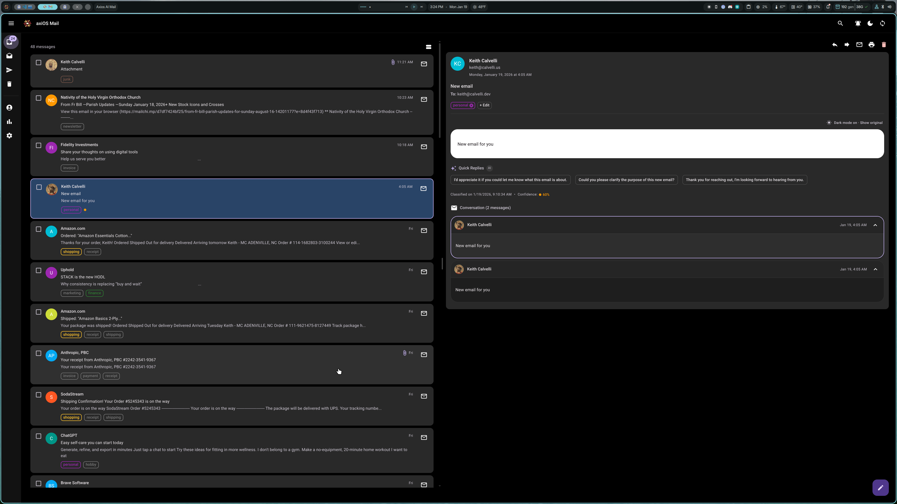
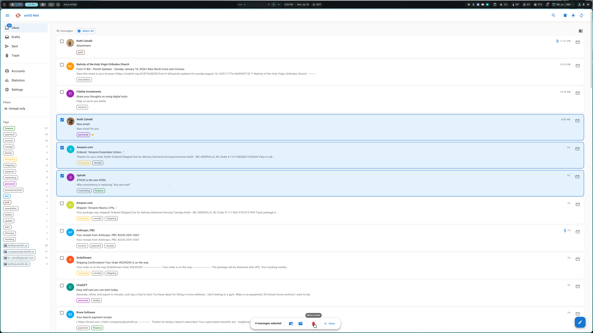
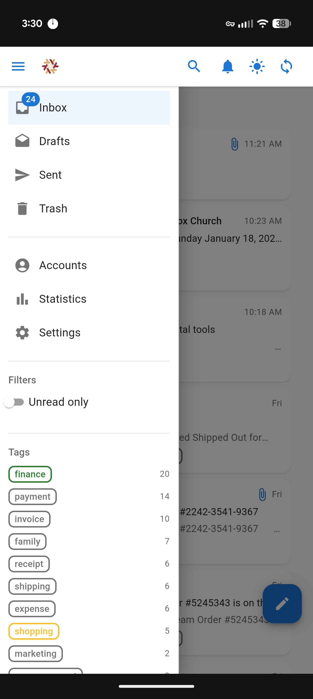
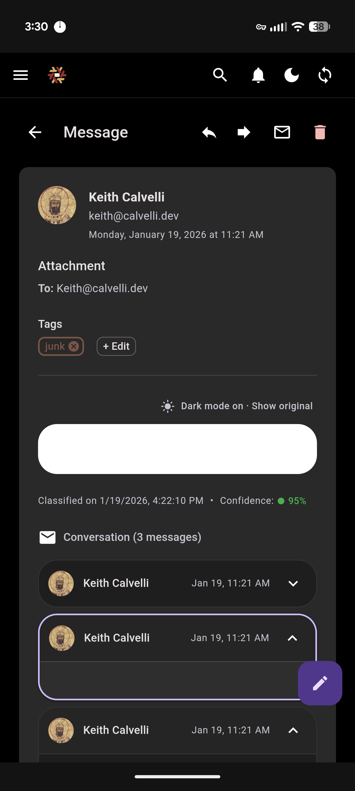
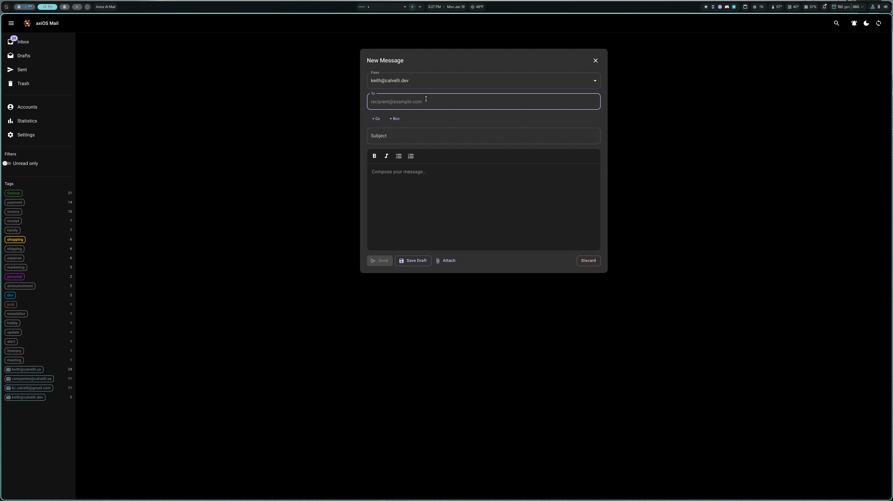
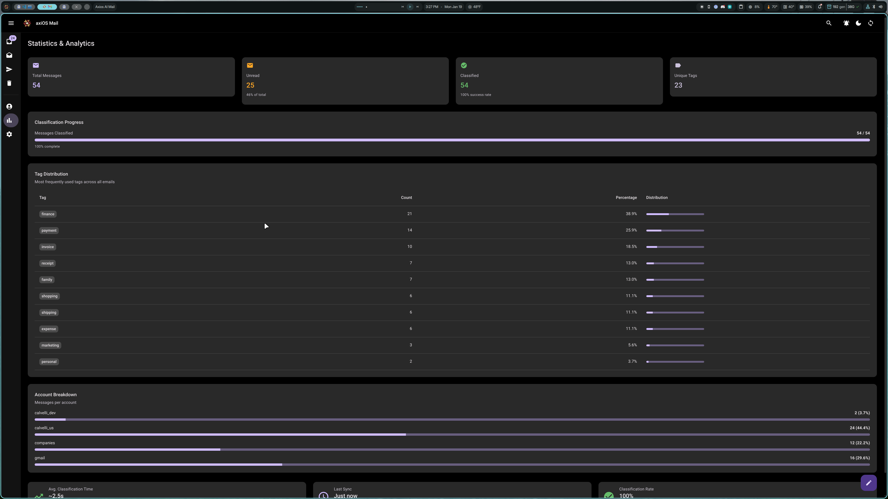
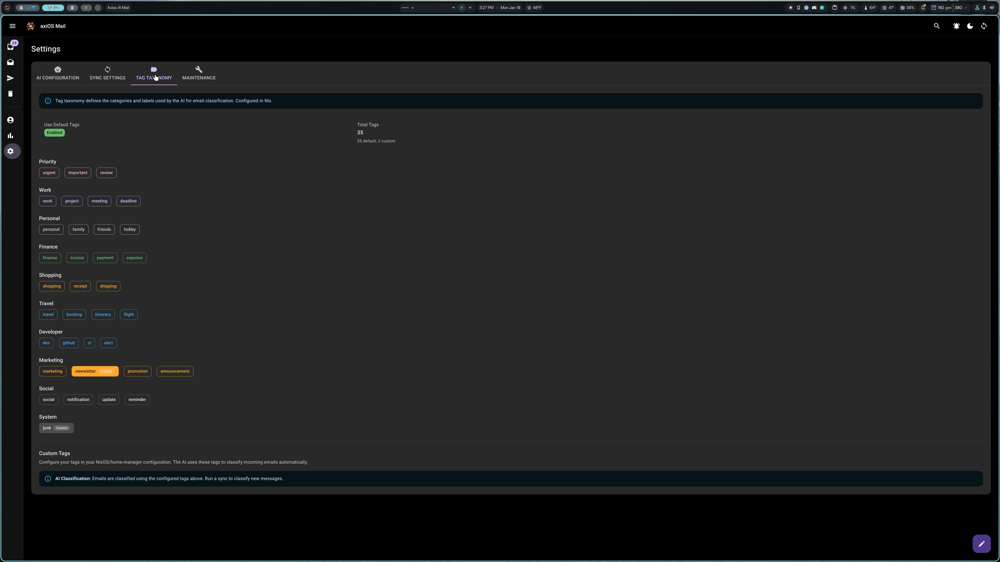
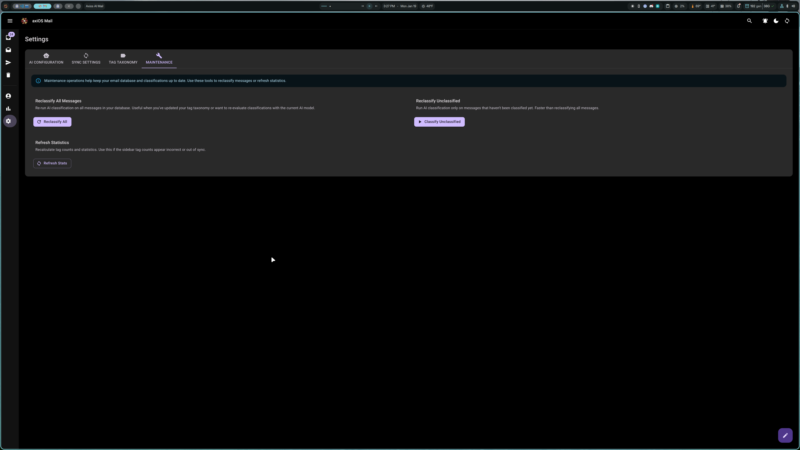

# axios-ai-mail

**AI-powered inbox organizer for NixOS and Home Manager users.**

axios-ai-mail is a declarative email management system that combines direct provider integration (Gmail, IMAP) with local AI classification to automatically organize your inbox. Messages are tagged, prioritized, and organized—all locally, with zero cloud dependencies for AI processing.



> **Note:** This application is designed for users of [axiOS](https://github.com/kcalvelli/axios), a NixOS configuration framework. The instructions below assume axiOS conventions (agenix for secrets, `~/.config/nixos_config` for configuration). Non-axiOS NixOS users may need to adapt paths and secret management approaches to their setup.

## Quick Links

- **[Quick Start Guide](docs/QUICKSTART.md)** - Get up and running in 15 minutes
- **[User Guide](docs/USER_GUIDE.md)** - Learn all features (desktop & mobile)
- **[Configuration Reference](docs/CONFIGURATION.md)** - All Nix options documented
- **[Architecture Overview](docs/ARCHITECTURE.md)** - System design deep-dive
- **[Development Guide](docs/DEVELOPMENT.md)** - Contributing and local development

## Features

### AI-Powered Classification
- **Automatic Tagging** - Messages tagged with categories like `work`, `finance`, `personal`, `shopping`
- **Confidence Scores** - Color-coded indicators show AI classification confidence
- **Customizable Taxonomy** - Define your own tags and categories in Nix
- **Local Processing** - All AI runs via Ollama, nothing leaves your machine

### Modern Web Interface
- **Responsive Design** - Works on desktop and mobile devices
- **Dark Mode** - System-aware theming with light/dark/auto modes
- **Split Pane View** - Preview messages without leaving the list (desktop)
- **Message Threading** - View conversation threads in context



### Email Management
- **Multi-Account** - Manage Gmail and IMAP accounts from a single interface
- **Folder Support** - Browse Inbox, Sent, Drafts, and Trash
- **Bulk Operations** - Select multiple messages for batch actions
- **Compose & Reply** - Full email composition with rich text formatting
- **Attachments** - View and download attachments

### Mobile Experience
- **Touch-Optimized** - Swipe gestures for common actions
- **PWA Support** - Install as a standalone app
- **Offline Indicator** - Visual feedback when disconnected

<p align="center">
  
  
</p>

### Keyboard Navigation
Full keyboard shortcut support for power users:
- `j`/`k` - Navigate messages
- `Enter` - Open message
- `r` - Reply
- `f` - Forward
- `u` - Toggle read/unread
- `#` - Delete
- `o` - Toggle split view
- `?` - Show all shortcuts

## Architecture

```
┌─────────────────────────────────────────────────────────┐
│                    Web UI (React)                       │
│  Material-UI • Tag Filtering • Bulk Actions • Search    │
└────────────────────┬────────────────────────────────────┘
                     │ HTTP/WebSocket
┌────────────────────▼────────────────────────────────────┐
│              FastAPI Backend (Python)                   │
│  REST API • WebSocket • Message Management • Sync       │
└─────┬──────────────────────────────────────────┬────────┘
      │                                          │
      │ Gmail API / IMAP                        │ Ollama API
      │                                          │
┌─────▼─────────────────┐              ┌────────▼─────────┐
│  Email Providers      │              │   AI Classifier  │
│  • Gmail (OAuth2)     │              │   • Local LLM    │
│  • IMAP (Password)    │              │   • Tag/Priority │
│  • Fastmail, etc.     │              │   • No cloud API │
└───────────────────────┘              └──────────────────┘
           │
           │ SQLite
           ▼
    ┌──────────────┐
    │   Database   │
    │  • Messages  │
    │  • Tags      │
    │  • Accounts  │
    └──────────────┘
```

## Installation

### Prerequisites

1. **NixOS or Home Manager** - This is a Nix-native application
2. **Ollama** - For local AI classification

### Add to Your Flake

```nix
{
  inputs = {
    nixpkgs.url = "github:nixos/nixpkgs/nixos-unstable";
    axios-ai-mail.url = "github:kcalvelli/axios-ai-mail";
  };

  outputs = { self, nixpkgs, axios-ai-mail, ... }: {
    homeConfigurations.youruser = home-manager.lib.homeManagerConfiguration {
      modules = [
        axios-ai-mail.homeManagerModules.default
        ./home.nix
      ];
    };
  };
}
```

### Enable in Home Manager

```nix
{
  programs.axios-ai-mail = {
    enable = true;

    ai = {
      model = "llama3.2";
      endpoint = "http://localhost:11434";
    };
  };
}
```

Then rebuild:

```bash
home-manager switch
```

For complete setup instructions including Gmail OAuth and IMAP configuration, see the **[Quick Start Guide](docs/QUICKSTART.md)**.

## Usage

### Start the Web Interface

```bash
axios-ai-mail web
```

Then open http://localhost:8080 in your browser.

### Sync Messages

```bash
# Sync all accounts
axios-ai-mail sync run

# Sync specific account with limit
axios-ai-mail sync run --account personal --max 50
```

### CLI Help

```bash
axios-ai-mail --help
axios-ai-mail sync --help
axios-ai-mail auth --help
axios-ai-mail accounts --help
```

## Screenshots

### Desktop Interface

| Dark Mode (Split Pane) | Light Mode (Bulk Selection) |
|------------------------|----------------------------|
|  |  |

| Compose Window | Statistics Dashboard |
|----------------|---------------------|
|  |  |

### Settings & Configuration

| Tag Taxonomy | Maintenance |
|--------------|-------------|
|  |  |

## Product Scope

**axios-ai-mail is an inbox organizer, not a spam filter.**

### What This Product Does
- Classifies legitimate mail that reached your inbox
- Organizes messages with AI-powered tags
- Identifies low-priority promotional content ("junk" tag)
- Helps you prioritize what matters

### What This Product Doesn't Do
- Does not filter spam - your email provider does this
- Does not sync spam folders - intentionally excluded
- Does not replace SpamAssassin/provider filters

## Roadmap

### Completed

- [x] AI-powered classification with confidence scores
- [x] Dark mode with system preference detection
- [x] PWA support (installable as desktop/mobile app)
- [x] Offline status indicator
- [x] Email composition and sending
- [x] Attachments view and download
- [x] Account maintenance CLI
- [x] Keyboard shortcuts in web UI
- [x] Mobile-responsive design with touch gestures
- [x] Message threading
- [x] Real-time sync via WebSockets
- [x] Bulk operations with undo
- [x] AI-generated quick replies

### Planned

- [ ] Outlook/Office365 provider
- [ ] User feedback loop for AI improvement
- [ ] Calendar integration
- [ ] Contact management

## Contributing

We welcome contributions! Please see [CONTRIBUTING.md](CONTRIBUTING.md) for guidelines.

1. Fork the repository
2. Create a feature branch
3. Make your changes
4. Submit a pull request

This project follows a [Code of Ethics](CODE_OF_ETHICS.md) rooted in principles of mutual respect and dignity.

## License

MIT License - see LICENSE file for details.

## Credits

Built with:
- [FastAPI](https://fastapi.tiangolo.com/) - Backend framework
- [React](https://react.dev/) - Frontend framework
- [Material-UI](https://mui.com/) - UI components
- [Ollama](https://ollama.com/) - Local LLM runtime
- [SQLAlchemy](https://www.sqlalchemy.org/) - Database ORM
- [React Query](https://tanstack.com/query) - Data fetching
- [Zustand](https://zustand-demo.pmnd.rs/) - State management

---

**axios-ai-mail** - Organize your inbox with AI, locally.
