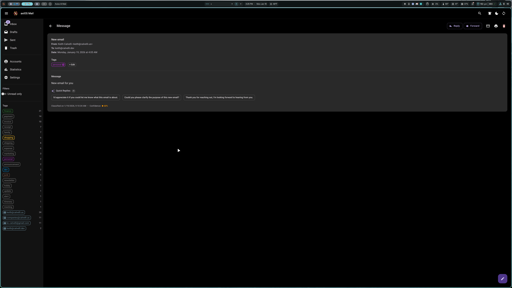
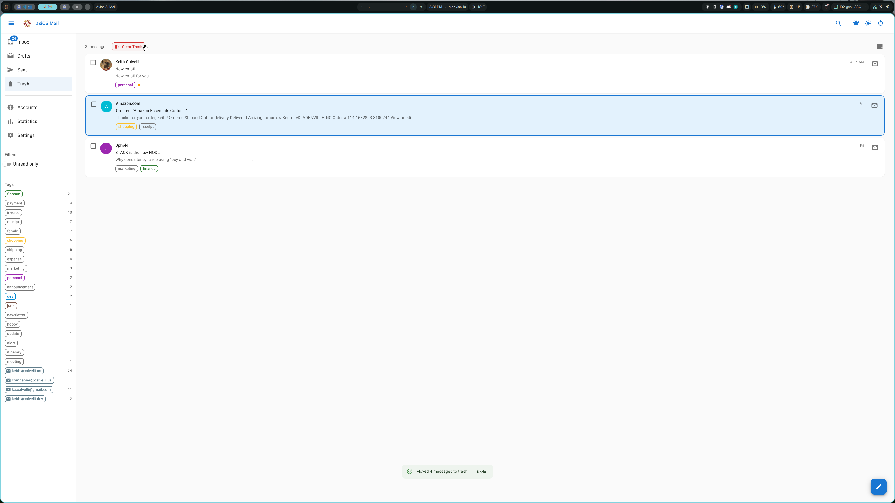

# User Guide

Complete guide to using axios-ai-mail on desktop and mobile devices.

## Table of Contents

- [Desktop Interface](#desktop-interface)
- [Mobile Interface](#mobile-interface)
- [Keyboard Shortcuts](#keyboard-shortcuts)
- [Theme Switching](#theme-switching)
- [PWA Installation](#pwa-installation)
- [Offline Behavior](#offline-behavior)

---

## Desktop Interface

### Overview

The desktop interface provides a full-featured email experience with a sidebar, message list, and reading pane.

### Sidebar Navigation

The sidebar (left panel) provides:

**Folders:**
- **Inbox** - All incoming messages
- **Drafts** - Unsent message drafts
- **Sent** - Messages you've sent
- **Trash** - Deleted messages (can be restored)

**Navigation:**
- **Accounts** - View and manage configured accounts
- **Statistics** - AI classification analytics
- **Settings** - Configure AI, tags, and maintenance

**Filters:**
- **Unread only** - Toggle to show only unread messages

**Tags:**
- Click any tag to filter messages by that classification
- Tags show message counts
- Account email addresses appear as filter options

### Message List

The center panel shows your messages:

- **Sender avatar** - Colored circle with initials
- **Subject line** - Bold if unread
- **Preview text** - First line of message body
- **Date/time** - When the message was received
- **Tags** - AI-assigned classification tags with colors
- **Attachment icon** - Indicates message has attachments
- **Confidence indicator** - Colored dot showing AI confidence

**Selection:**
- Click the checkbox to select individual messages
- Use "Select All" button in the header
- Selected messages show a blue highlight

### Split Pane View

When a message is selected, the right panel shows the message content:

- **Sender info** - Name, email, and avatar
- **Date** - Full timestamp
- **Tags** - Current tags with edit button
- **Quick Replies** - AI-generated response suggestions
- **Message body** - Full content with dark mode support
- **Thread view** - Collapsible conversation history
- **Action buttons** - Reply, Forward, Delete

Toggle split view on/off with the `o` key or the view button.

### Message Detail (Full Page)

Click a message to open it full-screen:

Features:
- Full message content
- Attachment preview and download
- Thread conversation view
- Reply/Forward buttons in header
- Back button to return to list

### Compose Window

Click the floating action button (pencil icon) or press `c` to compose:

- **From** - Select sending account
- **To** - Recipient email (autocomplete not yet supported)
- **Cc/Bcc** - Optional carbon copy fields
- **Subject** - Message subject line
- **Body** - Rich text editor with formatting
- **Attach** - Add file attachments
- **Save Draft** - Save for later
- **Send** - Send the message
- **Discard** - Cancel and close

### Bulk Operations

Select multiple messages to perform batch actions:

**Available actions:**
- **Mark as read** - Mark all selected as read
- **Mark as unread** - Mark all selected as unread
- **Move to trash** - Delete selected messages
- **Clear** - Deselect all

**From Trash folder:**
- **Restore** - Move back to original folder
- **Permanently delete** - Remove forever (cannot be undone)
- **Clear Trash** - Delete all trash messages

**Undo support:**
A toast notification appears after bulk delete with an "Undo" button.

### Statistics Dashboard

View AI classification analytics:

- **Total messages** - Count of all synced messages
- **Unread** - Number of unread messages
- **Classified** - Messages with AI tags
- **Unique tags** - Number of different tags used
- **Tag distribution** - Bar chart of tag usage
- **Account breakdown** - Messages per account
- **Classification time** - Average AI processing time
- **Last sync** - When sync last ran

### Settings

Configure the application:

**Tabs:**
- **AI Configuration** - Model, endpoint, temperature
- **Sync Settings** - Frequency, batch size
- **Tag Taxonomy** - View configured tags
- **Maintenance** - Reclassify messages, refresh stats

---

## Mobile Interface

The mobile interface is optimized for touch interaction with a responsive layout.

### Navigation Drawer

Tap the hamburger menu (☰) to open the drawer:

The drawer contains:
- Folder navigation (Inbox, Drafts, Sent, Trash)
- Accounts, Statistics, Settings links
- Filters (Unread only)
- Tag list with counts

Tap outside the drawer or swipe left to close.

### Message List (Mobile)

Messages display in a compact card format:
- Sender and subject
- Preview text
- Date
- Tags
- Unread indicator

### Swipe Gestures

On mobile, use swipe gestures for quick actions:

| Gesture | Action |
|---------|--------|
| **Swipe Left** | Delete (move to trash) |
| **Swipe Right** | Enter selection mode |

**Swipe Left (Delete):**
- Reveals a red delete indicator
- Complete the swipe to delete
- Message moves to Trash
- Undo available via toast

**Swipe Right (Select):**
- Reveals a blue checkbox indicator
- Complete the swipe to enter selection mode
- Tap additional messages to add to selection
- Use the action bar for bulk operations

### Selection Mode (Mobile)

When in selection mode:
- Checkboxes appear on all message cards
- Tap messages to toggle selection
- Floating action bar shows at bottom
- "Exit" button to leave selection mode

### Message Detail (Mobile)

Tap a message to view full content:

Features:
- Full message content
- Thread view with collapsible messages
- Tag display with edit option
- Action buttons (Reply, Forward, Delete)
- Dark mode toggle for HTML content
- Swipe back or tap back arrow to return

### Compose (Mobile)

Tap the floating action button to compose:
- Optimized keyboard layout
- Full-screen composition
- Same features as desktop

---

## Keyboard Shortcuts

Full keyboard navigation for power users:

### Navigation

| Key | Action |
|-----|--------|
| `j` | Move to next message |
| `k` | Move to previous message |
| `Enter` | Open selected message |
| `Escape` | Close message / exit selection |

### Message Actions

| Key | Action |
|-----|--------|
| `r` | Reply to message |
| `f` | Forward message |
| `a` | Reply all |
| `c` | Compose new message |

### Message Management

| Key | Action |
|-----|--------|
| `u` | Toggle read/unread |
| `#` | Delete message (move to trash) |
| `e` | Archive message |
| `x` | Select/deselect message |

### View Controls

| Key | Action |
|-----|--------|
| `o` | Toggle split pane view |
| `/` | Focus search box |
| `?` | Show keyboard shortcuts help |
| `g` then `i` | Go to Inbox |
| `g` then `s` | Go to Sent |
| `g` then `t` | Go to Trash |

---

## Theme Switching

axios-ai-mail supports three theme modes:

### Light Mode
Clean, bright interface with light backgrounds.

### Dark Mode
Dark backgrounds with light text, easier on eyes in low light.

### Auto (System)
Follows your operating system's theme preference.

**To switch themes:**
1. Click the theme toggle button in the top bar
2. Icon cycles through: ☀️ (light) → 🌙 (dark) → 🔄 (auto)

**HTML Email Rendering:**
For HTML emails, you can toggle "Dark mode on/off" to switch between:
- **Dark mode on** - Inverts email colors for dark theme
- **Show original** - Displays email in its original styling

---

## PWA Installation

Install axios-ai-mail as a Progressive Web App for a native-like experience.

### Desktop (Chrome/Brave/Edge)

1. Open http://localhost:8080
2. Look for the install icon in the address bar
3. Click "Install"
4. App appears in your application launcher

### Mobile (Android)

1. Open http://localhost:8080 in Chrome
2. Tap the menu (⋮)
3. Select "Add to Home screen"
4. Confirm installation

### Mobile (iOS)

1. Open http://localhost:8080 in Safari
2. Tap the Share button
3. Select "Add to Home Screen"
4. Name the app and tap "Add"

### PWA Features

When installed as a PWA:
- Opens in its own window (no browser chrome)
- Appears in your app launcher
- Can be pinned to taskbar/dock
- Offline indicator shows connection status

---

## Offline Behavior

axios-ai-mail handles offline scenarios gracefully:

### When Offline

- A warning banner appears at the top of the screen
- Previously loaded messages remain visible
- Actions are queued (with notification)
- Search works on cached data

### When Back Online

- Banner disappears
- Queued actions are executed
- New messages sync automatically

### Checking Status

The top bar shows connection status:
- **Green dot** - Connected and synced
- **Yellow banner** - Offline or connection issues

---

## Tips & Tricks

### Efficient Email Processing

1. **Use tag filters** - Click a tag to focus on one category
2. **Bulk select** - Use swipe-right (mobile) or checkboxes to select multiple
3. **Keyboard navigation** - `j`/`k` to move, `#` to delete, no mouse needed

### AI Classification

- **High confidence (green)** - AI is very sure about the tag
- **Medium confidence (orange)** - Reasonably confident
- **Low confidence (red)** - May need manual review

### Managing Multiple Accounts

- Filter by account email in the sidebar
- Different accounts can have different sync frequencies
- All accounts appear in a unified inbox

### Quick Replies

AI-generated quick reply suggestions appear on messages:
- Click to start a reply with that text
- Suggestions based on message content
- Can be edited before sending
